# Yoga With Billy

## Site Overview

Yoga with Billy is a user-friendly website for yoga lovers. The website offers users an opportunity to learn about yoga practices, book classes, and get to know the instructor, Billy. 

Live site: https://amelia5p.github.io/YogaWithBilly/

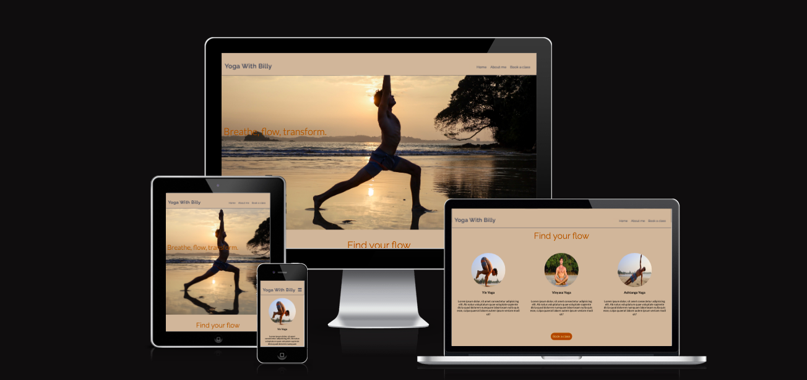 

<!-- TOC start (generated with https://github.com/derlin/bitdowntoc) -->

Table of Contents 

- [Yoga With Billy](#yoga-with-billy)
  * [Site Overview](#site-overview)
- [User Experience](#user-experience)
  * [Design](#design)
    + [Wireframes](#wireframes)
    + [Color Palette](#color-palette)
    + [Typography](#typography)
    + [Images](#images)
  * [User Stories](#user-stories)
      - [First time visitor goals](#first-time-visitor-goals)
      - [Returning visitor goals](#returning-visitor-goals)
- [Site Structure](#site-structure)
  * [Features](#features)
    + [Navigation Bar](#navigation-bar)
    + [Hero section/ landing content](#hero-section--landing-content)
    + [Homepage](#homepage)
    + [About me page](#about-me-page)
    + [Book a class page](#book-a-class-page)
    + [Thank you page](#thank-you-page)
    + [Footer](#footer)
    + [Responsiveness](#responsiveness)
    + [Future features](#future-features)
- [Testing](#testing)
  * [Feature Testing](#feature-testing)
  * [Browsers Compatibility](#browsers-compatibility)
  * [Responsiveness](#responsiveness-1)
  * [Lighthouse Testing](#lighthouse-testing)
  * [Code Validation](#code-validation)
      - [HTML](#html)
      - [CSS](#css)
- [Bugs](#bugs)
- [Deployment](#deployment)
    + [Step 1:](#step-1-)
    + [Step 2:](#step-2-)
    + [Step 3:](#step-3-)
    + [Result:](#result-)
- [Cloning Repository](#cloning-repository)
    + [Step 1:](#step-1--1)
    + [Step 2:](#step-2--1)
    + [Step 3:](#step-3--1)
    + [Step 4:](#step-4-)
    + [Result:](#result--1)
- [Forking Repository](#forking-repository)
    + [Step 1:](#step-1--2)
    + [Step 2:](#step-2--2)
    + [Step 3:](#step-3--2)
    + [Result:](#result--2)
- [Credits](#credits)
  * [Images and content](#images-and-content)
  * [Background Image](#background-image)
  * [Favicon](#favicon)
  * [Other](#other)
  * [Code / Educational Resources](#code---educational-resources)
- [Acknowledgements](#acknowledgements)

<small><i><a href='http://ecotrust-canada.github.io/markdown-toc/'>Table of contents generated with markdown-toc</a></i></small>

<!-- TOC end -->

  

# User Experience

## Design

Wireframes were made in Balsamiq to ensure a clear and easy development process, however please note that the final design may not match these wireframes exactly as many iterations were explored. The color palette was created using Muzli colors, the colors used are quite muted creating a relaxed experience for users. The images used throughout the website inspired the color scheme, this created a consistent and cohesive theme. The 'Raleway' and 'Lato' fonts were chosen for their elegance and warmth. These fonts are also highly legible, making them a great choice. Sans Serif is used as the fallback font.

### Wireframes

### Color Palette 

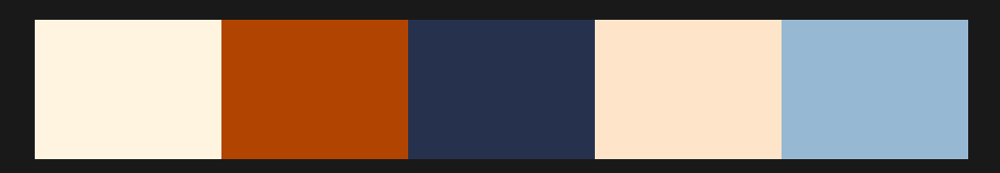

### Typography

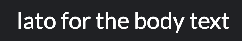

### Images
The images used were professionally taken and were provided to me by the business owner to use on the site. The images are compressed to optimise the sites loading times. 

## User Stories

### First time visitor goals
* As a first time user, I want to easily understand the purpose of the site and learn more about the business.
* As a first time user, I want to know what kind of classes are available.
* As a first time user, I want to be able to navigate easily through the website.
* As a first time user, I want to be able to find contact details.
* As a first time user, I want to be able to find out information about the owner/yoga teacher.

### Returning visitor goals
* As a returning user, I want to be able to navigate through the website on multiple devices.
* As a returning user, I want to be able to book a class seamlessly. 
* As a returning user, I want to be able to easily find social media links.

# Site Structure

There are currently three pages on the website: Home, About me and Book a class there is also a thank you page to which  the user will be redirected once they submit the form. The landing page is the home page. The other pages are easily visible and accessible in the navigation bar at the top. The logo which is also at the top of the page, when clicked, brings the user back to the homepage. 

## Features

### Navigation Bar
The navigation bar shows links to each of the pages. It is fully responsive, turning into a hamburger menu on smaller screen sizes. 

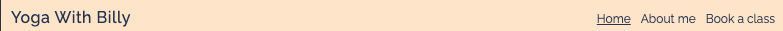

### Hero section/ landing content
The content you see when you click on the website is an attractive hero image and hero text which gives the user immediate knowledge of the purpose of the site.

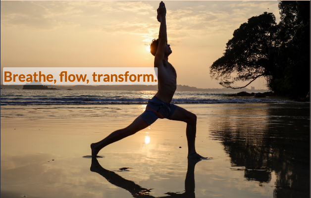

### Homepage
The homepage is made up of the hero section which is an attactive image and text, underneath this, there are three images with three concise descriptions of different yoga styles to give the user information on the classes provided. At the bottom of the page there is a call to action (button) which allows the user to book a class. The button is linked to the book a class page.

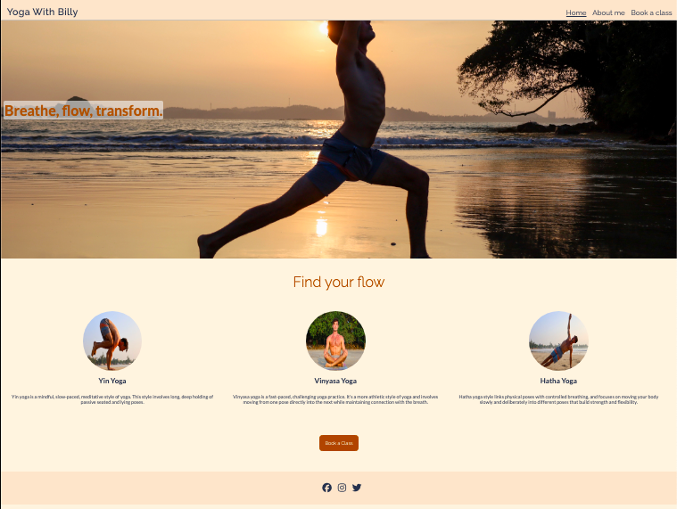 

### About me page

The about me page has a brief personal description about Billy, underneath this there are three cards containing images with a description of Billy's qualifications, skills and expertise. The background is calming and the style simple.

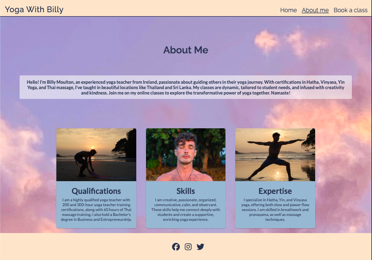

### Book a class page 

The book a class page has the same background as the About me page for consistency in the styling, the page consists of a simple-to-use form that has no unnecessary questions. There are clear prompts shown to the user if they don't enter the required information before submitting. Once the user has submitted the form they are redirected to a 'thank you' page which enhances the user's experience.

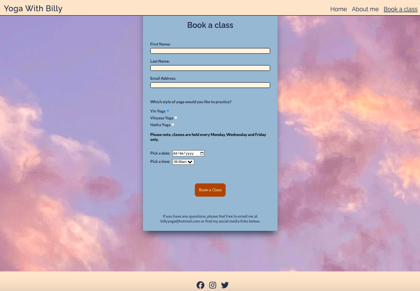

### Thank you page

The thank you page has a thank you note and is styled the same as the other pages, its purpose is to thank the user for submitting the form, enhance the user experience, and inform the user their submission was successful.

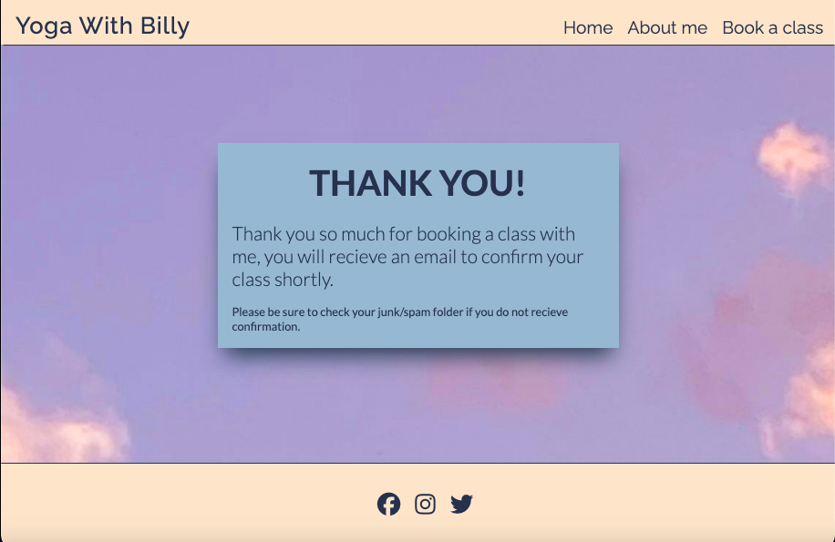

### Footer
The footer is located at the bottom of the page and contains links to social media accounts using attractive icons.

### Responsiveness

The site is responsive from 270px and functions on a range of screen sizes. It was built prioritising mobile's first and media queries were applied to ensure responsiveness on larger screen sizes. 

### Accessibility
Aria-lables, alt text, color contrast and font selections were thoughtfully chosen to ensure an inclusive and accesible user experience.

### Future features
 I would like to implement the following features in the future to allow for an improved user experience:
 - Sign up and Login feature to allow users a personalised experience.
 - A feature which shows users previous classes and upcoming classes.
 - A loyalty scheme where the user gets every 6th class free if they sign up on the site, this would increase customer retention.
 - A large library of video and images showing snippets of classes and yoga poses.

# Testing

## Feature Testing 

| Feature | Action | Result |
| ---|---|:---:|
| Logo | Brings to homepage when clicked | PASS |
| Navigation Menu/Hamburger Menu | Brings you to correct pages, lets you know what page you are currently on | PASS |
| Book a class button | Brings you to form page to book class | PASS |
| Social Media Links | Brings you to external social media pages | PASS |
| Form Submission | When you submit the form it brings you to thank you page | PASS |
| Form Inputs | Must enter required data into each input field | PASS |

## Browsers Compatibility
The site was tested using Dev Tools on Google Chrome, Safari, Firefox and Edge and functions and appears as it should across all major browsers. I also tested it on an Iphone 12 mini and a Samsung Galaxy S21 ultra.

## Responsiveness

Responsiveness was tested with Chrome Dev Tools and by changing the viewport from 270px and upwards. I also checked responsiveness on 'Am I Responsive' and Responsive test tool.  I also tested it on an Iphone 12 mini and a Samsung Galaxy S21 ultra.

## Lighthouse Testing
The lighthouse testing was successful with scores above 90 across all pages for all four ratings (Performance, Accessibility, Best Practices and SEO).

### Home page
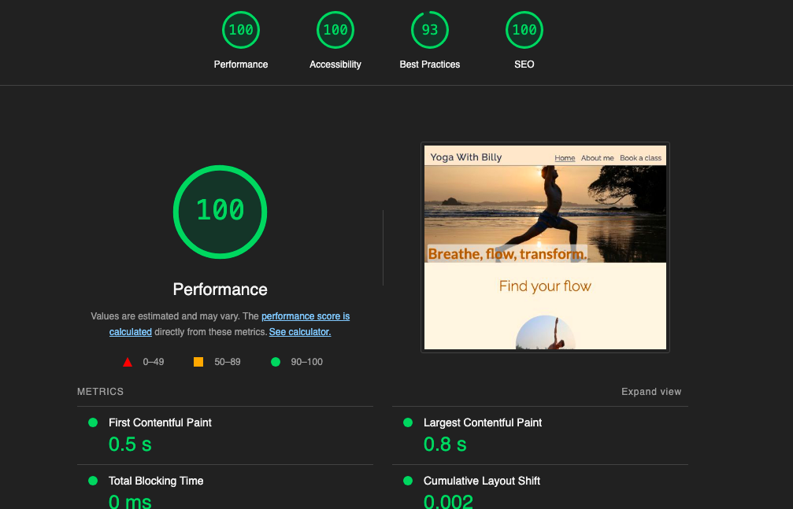

### About me page
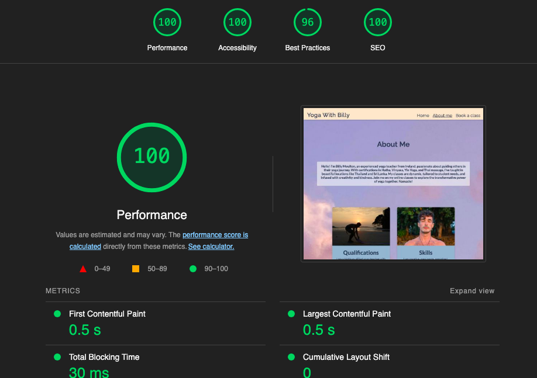

### Book a class page
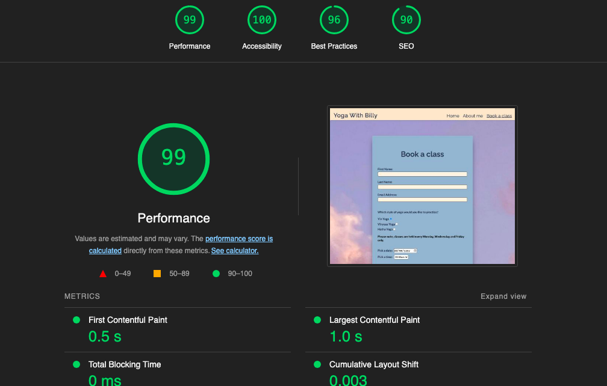

### Thank you page
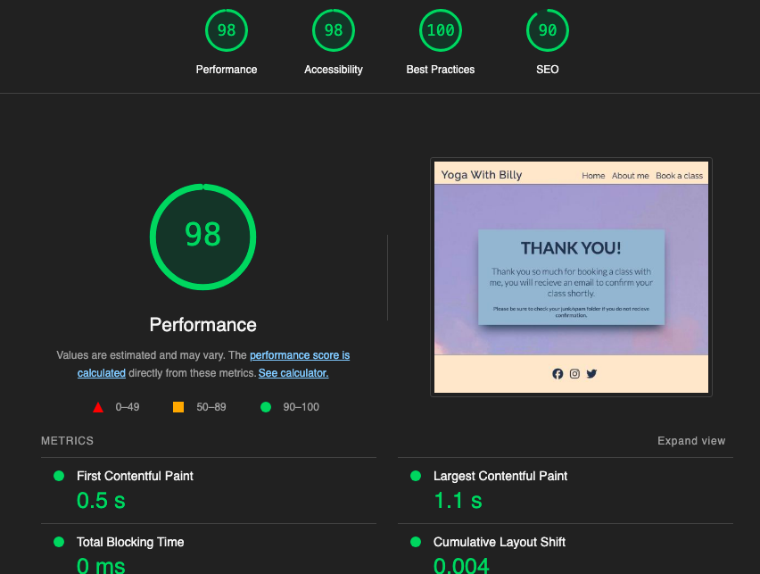

## Code Validation

#### HTML

All pages were tested through the W3C validator with no errors:

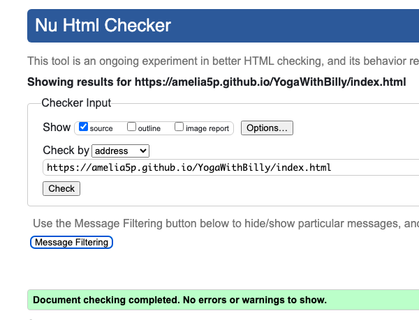 
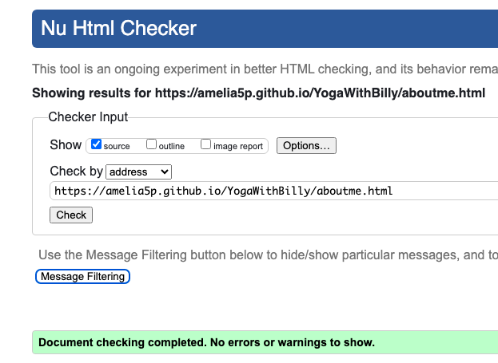 
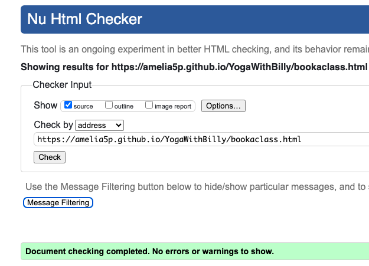 

#### CSS

The CSS stylesheet was tested through the W3C Validator with no errors:

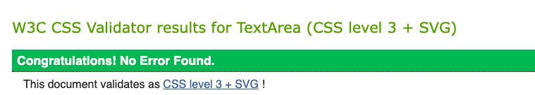 

# Bugs

Debugging and problem solving was done consistently throughout the development process.

List of some issues that arose:

* The hero image wasn't 100% in width and image was in px which was stretching across the screen and didn't know what to priotritise- change to %.
* The hero image was not showing up when I deployed for the first time, I fixed the file path to solve this issue.
* When the text was changed on the homepage under the title Yin Yoga, the text underneath Vinyasa yoga spilled out, I fixed this issue by setting media queries with width values. 
* There was an error in my HTML, I had an anchor tag nested within my button element, I realised this was an issue and fixed it by removing the button element.
* The footer on the about me page was twice the height it should be, fixed this by setting the background image at 100vh which pushed the footer down.
* The hamburger drop down menu when opened was covering some content, I fixed this by adding some padding.

# Deployment

This site has been built on Gitpod, the code was then pushed to Github where it was deployed.

### <ins>Step 1:</ins>

From the <a href="https://github.com/Amelia5p/YogaWithBilly" target="_blank">Github repository</a> click on settings which is near the top op the right side of the page.

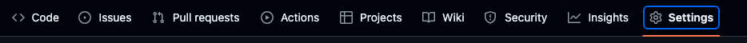

### <ins>Step 2:</ins>
From the options listed on the left hand side of the page, click 'Pages'.

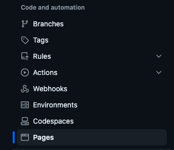

### <ins>Step 3: </ins>
From the drop down menu under source select deploy from branch. From the dropdown menu's under branch select 'Main' and 'Root' then click save.

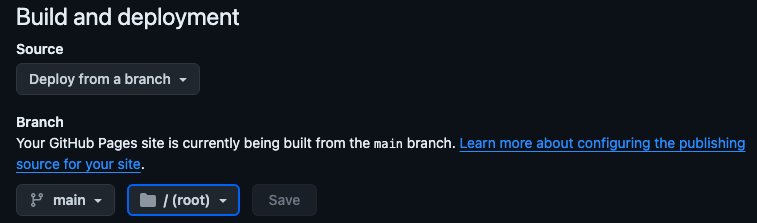

### <ins>Result:</ins>
The page will be refreshed and you will see the link to the live site.

## Cloning Repository

### <ins> Step 1: </ins>

From the <a href="https://github.com/Amelia5p/YogaWithBilly" target="_blank">Github repository</a> click on the 'code' button.

### <ins> Step 2:</ins>

Click 'local' on the top of the drop down menu and copy the URL.

### <ins>Step 3: </ins>

Open Git Bash on windows and change the working directory to the location where you want the cloned directory.

### <ins>Step 4: </ins>

Type 'Git clone' followed by a space and paste the URL previously copied, hit enter.

### <ins> Result: </ins> 

You now have a local copy of the Github repository.

## Forking Repository

### <ins>Step 1:</ins>

From the <a href="https://github.com/Amelia5p/YogaWithBilly" target="_blank">Github repository</a> click on the 'fork' button in the top right corner of the page. 

### <ins>Step 2:</ins> 

Choose to copy only the main branch or all branches to the new fork.

### <ins>Step 3: </ins>

Click Create a Fork.

### <ins>Result:</ins>

There is now a forked copy on Github.

# Credits

## Images and content

- All images used on the site were taken professionally and provided to me by the owner of the business.

## Background Image

- The only image I sourced was from Pexels https://www.pexels.com/photo/bright-sky-with-fluffy-clouds-7283618/

## Favicon

- <a href="https://favicon.io/favicon-converter/#google_vignette"> Favicon Converter</a>
- <a href="https://www.canva.com/"> Canva</a>
 

## Other
- <a href="https://fonts.google.com/"> Google Fonts</a>
- <a href="https://www.w3schools.com/"> W3schools</a>
- <a href="https://colors.muz.li/"> Muzli Colors</a>
- <a href="https://www.shutterstock.com/image-resizer">Shutterstock to resize images</a>

## Code / Educational Resources

- How to create cards: https://www.youtube.com/watch?v=9FNNkzPBFcE
- Code institutes 'Love Running' project.
- Information regarding yoga practices: <a href="https://fusionwellness.com.au/">Fusion wellness</a>

# Acknowledgements 
This is project one, created for the Code Institutes Full Stack Web Developer (eCommerce) course. I would like to thank my cohort facilitator Laura, my mentor and the Code Institute team for their support.
